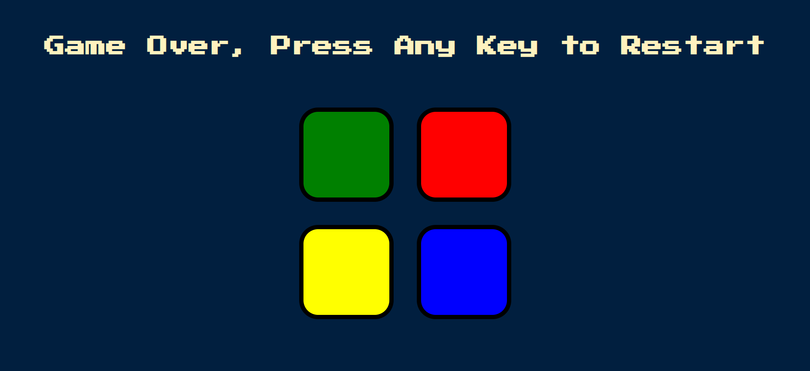

<h2 align="center">
Simon Game  
</h2>

  

 

 
 &nbsp;
 &nbsp;
 &nbsp;
 &nbsp;

<h3 align="center">
    🔹
    <a href="https://github.com/ManojParkale/Simon-Game/issues">Report Bug</a> &nbsp; &nbsp;
    🔹
    <a href="https://github.com/ManojParkale/Simon-Game/issues">Request Feature</a>
</h3>

## TL;DR

You can fork this repo to modify and make changes of your own. Please give me proper credit by linking back to [ManojParkale](https://github.com/ManojParkale/Simon-Game). Thanks!
 

## Description:
The Simon game is an electronic memory challenge where players replicate an increasing sequence of lights and sounds by pressing colored buttons in the correct order.

## Built With

- JavaScript
- HTML
- CSS
- VsCode

## Features

**📖   Single-Page Layout**

**🎨 Styled with CSS, easy to customize colors**

**📱 Fully Responsive**

The page will reload if you make edits.
You will find all the components used and you can edit your information accordingly.

### Show your support

Give a ⭐ if you like this website!

